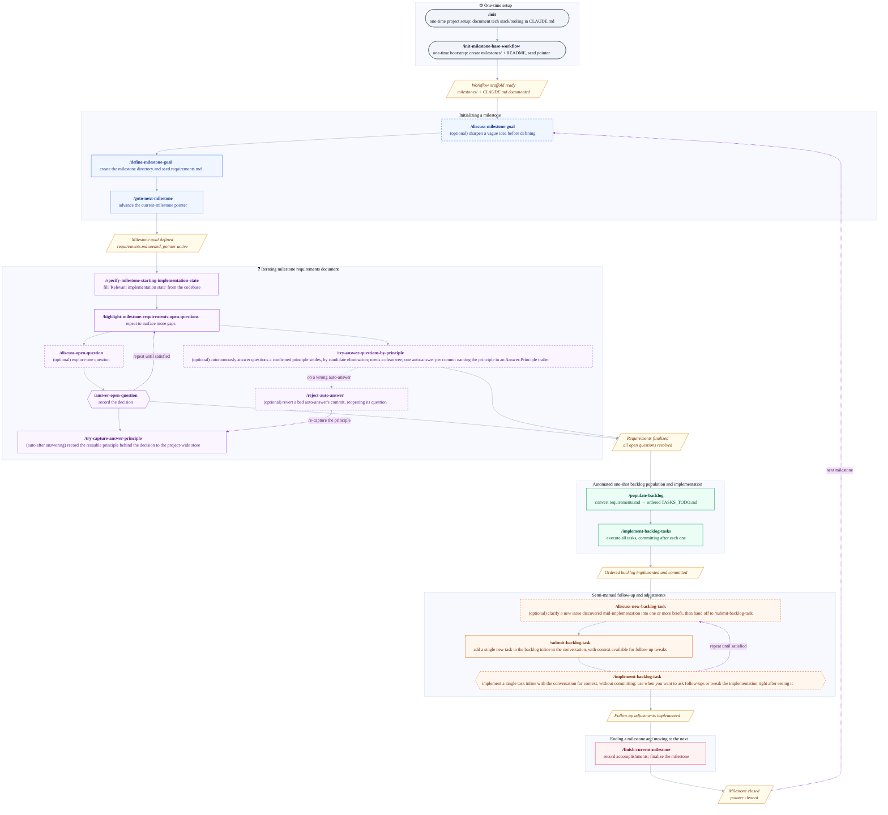

<p align="center">
    
</p>
<p align="center">
  <a href="https://github.com/uHappyLogic/cairn/releases/latest">
    
  </a>
  <a href="LICENSE">
    
  </a>
</p>

---

# Cairn

**Mark the path from idea to shipped.**
Milestone-driven development for any stack.

## Why Cairn?

Large-scale software projects fail in predictable ways: the goal drifts during planning, ambiguities pile up before coding starts, the backlog grows unbounded, and there's no clear line between "working on it" and "done."

Cairn gives Claude Code a structured, repeatable process for moving an idea from rough goal to shipped code — one milestone at a time. Each milestone is a self-contained unit: you clarify the goal, resolve every open question, populate an ordered backlog, implement the tasks, and close out the milestone before moving on. Nothing falls through the cracks because every decision is recorded and every requirement maps to a task.

It works with any tech stack. Skills read your project's environment (tooling, conventions, build commands) from `CLAUDE.md`, so the workflow adapts to whatever you're building.

## Installation

In any Claude Code project, run:

```
/plugin marketplace add uHappyLogic/cairn
```

Then bootstrap the milestones scaffold once in your project root:

```
/init-milestone-base-workflow
```

Run `/init` to document your project's tech stack and tooling in `CLAUDE.md` so skills can read the environment context.

## How it works

Each milestone lives in `milestones/milestone_<N>_<slug>/` and contains three files:

- `requirements.md` — goal, relevant implementation state, implementation decisions, and open questions
- `TASKS_TODO.md` — pending tasks ordered by priority (highest first)
- `TASKS_DONE.md` — completed tasks appended in the same format

`milestones/README.md` is the source of truth for which milestone is active. Skills read and write the current-milestone pointer there; it is never ambiguous which milestone is open.

## Workflow pipeline



## Skill reference

### `init-milestone-base-workflow`

One-time bootstrap for a project. Creates the `milestones/` directory and `milestones/README.md` with the current-milestone pointer, and ensures `CLAUDE.md` carries the `## Milestone Workflow` guidance. Additive and idempotent — creates missing scaffolding and inserts missing sections into existing files, never overwrites existing content. Run this before any other workflow skill.

### `discuss-milestone-goal <overall_goal_description>`

Facilitates a structured conversation to sharpen a vague goal into a clear, actionable statement. Produces a refined goal description ready for `/define-milestone-goal`. Creates no files.

### `define-milestone-goal <overall_goal_description>`

Creates a new `milestones/milestone_<N>_<slug>/` directory with `requirements.md` (Goal section filled), plus empty `TASKS_TODO.md` and `TASKS_DONE.md`. Does **not** activate the milestone.

### `specify-milestone-starting-implementation-state <milestone_id>`

Reads the milestone goal, explores the project using the environment documented in `CLAUDE.md`, and writes a concise technical summary into the `## Relevant implementation state` section of `requirements.md`. Sets up the context needed to make informed implementation decisions.

### `highlight-milestone-requirements-open-questions`

Scans the current milestone's `requirements.md` and surfaces remaining ambiguities or decisions that need to be made before the backlog can be populated. Run it multiple times — earlier answers often open new questions.

### The answer-principle-learning loop

Open questions get resolved two ways, and the project *learns* from every manual answer. Confirmed answering principles accumulate in `milestones/answer_decision_principles.md` — a single project-wide store at the `milestones/` **root**, above any one milestone, so principles carry across milestones. Each principle is a reusable keep/eliminate directive that future autonomous answers can apply.

- **Manual teaching flow** — `/discuss-open-question → /answer-open-question → (auto) /try-capture-answer-principle`. You deliberate a question, record the answer, and `answer-open-question` automatically offers to generalize the rule behind it into a confirmed principle.
- **Autonomous sweep** — `/try-answer-questions-by-principle` re-sweeps the requirements and auto-answers exactly the questions those confirmed principles already settle, one traceable commit per answer.
- **Correction loop** — `/reject-auto-answer → re-capture`. If the sweep gets one wrong, reject reverts that commit (reopening the question) and points you back to `/try-capture-answer-principle` to revise the offending principle so the next sweep does better.

### `discuss-open-question <question_name>`

Opens a structured conversation about a named open question in `requirements.md`. Surfaces alternatives, trade-offs, and a recommendation to help reach a decision.

### `answer-open-question <question_name>`

Records the resolution of a named open question in `requirements.md`, updating the document to reflect the decision and its downstream implications. After recording, it automatically chains into `/try-capture-answer-principle` to offer to generalize the decision into a reusable answering principle.

### `try-capture-answer-principle [focus_hint]`

Extracts a reusable answering principle from a decision just made and records it in the project-wide principle store `milestones/answer_decision_principles.md`. Runs automatically after `/answer-open-question`, and is also directly invocable with an optional free-text focus hint. It analyzes the conversation's deliberation, exits quietly when nothing generalizes, and only ever proposes a revise-or-add for you to confirm — never editing the store silently. It is the **sole writer** of the principle store.

### `try-answer-questions-by-principle`

The autonomous sweep. Re-reads every open and deferred question in the current milestone's `requirements.md` and answers exactly those a confirmed principle already settles, by **candidate elimination** — enumerate the realistic answers, keep only those a confirmed principle supports, and auto-answer only when a single survivor remains. Requires a clean working tree, and commits **one auto-answer per commit**: subject `Principle-based-answer: <question>`, with each applied principle named in an `Answer-Principle:` trailer line. It is a pure orchestrator — it dispatches the read-only `try-answer-question-by-principle` subagent per question and owns all recording and committing. On a fresh project with no principles taught yet, it resolves nothing.

### `try-answer-question-by-principle` (subagent)

Read-only candidate-elimination subagent dispatched once per question by `/try-answer-questions-by-principle` — not user-invocable. Reads the principle store, enumerates the realistic candidate answers, keeps only those a confirmed principle supports, and returns a verdict naming the unique survivor (if any) and the load-bearing principles. It mutates nothing; the orchestrator owns all document edits and commits.

### `reject-auto-answer [commit-id | text_fragment]`

Reverts one bad auto-answer from the sweep. Takes an optional argument — a commit id from the sweep's report, a fragment of the wrong folded decision text in `requirements.md`, or nothing (defaults to `HEAD`). It validates the target is a genuine auto-answer commit (touches only `requirements.md`, carries an `Answer-Principle:` trailer), shows it for confirmation, then `git revert --no-commit`s it — which **reopens** the answered question — leaving the revert staged. It never edits the principle store; it points you to re-capture the principle behind the bad answer so the next sweep does not reproduce it.

### `populate-backlog`

Converts the current milestone's `requirements.md` into `TASKS_TODO.md` — a complete, dependency-ordered list of atomic, AI-executable tasks. Decomposes the milestone into high-level briefs, proves every requirement is covered, then delegates detailed task authoring to the `submit-backlog-task` agent. Requires all open questions to be resolved first.

### `discuss-new-backlog-task <issue description>`

Clarifies a rough or oversized issue discovered mid-implementation into one or more clear, task-sized briefs through a short conversation, then hands each off to `/submit-backlog-task`. Use it when the affected system, desired behavior, or verification isn't yet clear, or when one issue is really several tasks.

### `submit-backlog-task <issue description>`

Adds a single, already-clear issue to `TASKS_TODO.md`. Triages for duplicates and decides where the task belongs, then authors and inserts the task **inline, in the current conversation** so the authoring context stays available for follow-up tweaks. For vague or multi-task issues, route through `/discuss-new-backlog-task` first.

### `implement-backlog-tasks`

Orchestrator: executes all tasks in `TASKS_TODO.md` top to bottom, spawning one subagent per task and committing after each success. Stops on first failure.

### `implement-backlog-task <task_name>`

Implements a single named task from `TASKS_TODO.md` **inline, in the current conversation**. Running inline keeps the implementation context (what changed, why, how it was verified) in the conversation so you can ask follow-up questions or request tweaks right after. Changes are left staged — use `/implement-backlog-tasks` to implement the whole backlog unattended with automatic commits.

### `finish-current-milestone`

Verifies all tasks are done, writes a completion summary to `milestones/README.md`, and updates `CLAUDE.md` only for lasting tech-stack or structural changes. Clears the current-milestone pointer — run `/goto-next-milestone` after.

### `goto-next-milestone <number> <title>`

Creates the next milestone directory with empty starter files and updates the current-milestone pointer in `milestones/README.md`. Only runnable after `/finish-current-milestone` has cleared the active pointer.

## Self-dogfooding

This repository runs its own workflow on itself. The `milestones/` directory, `milestones/README.md`, and the active milestone directory (`milestones/milestone_01_public-release-prep/`) are live workflow artifacts produced by Cairn's own skills — the requirements, backlog, and completed tasks for the current milestone are all right there in the repo. If you want to see what a real milestone looks like end-to-end, look no further.

## License

MIT — see [LICENSE](LICENSE).
