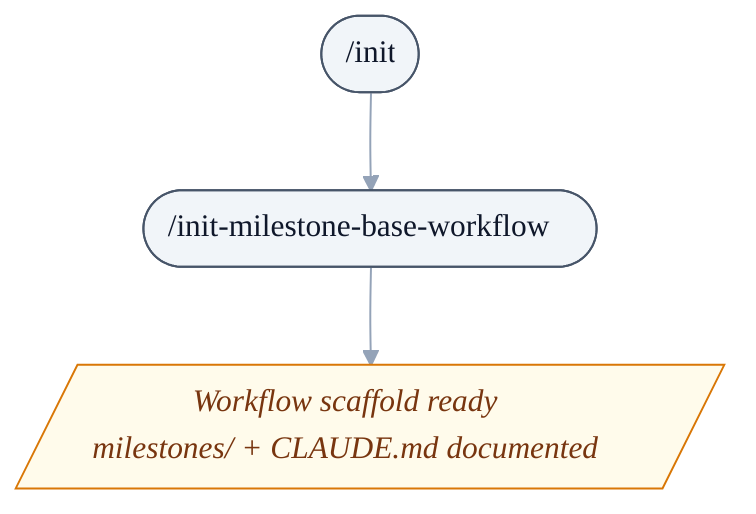
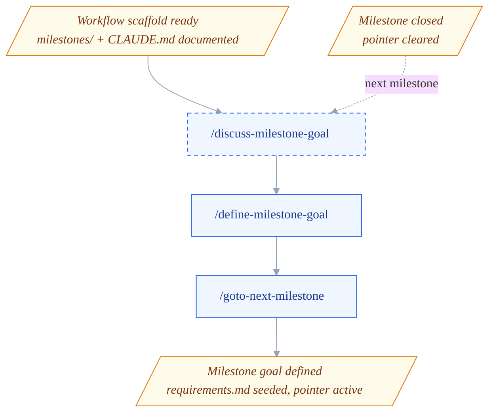
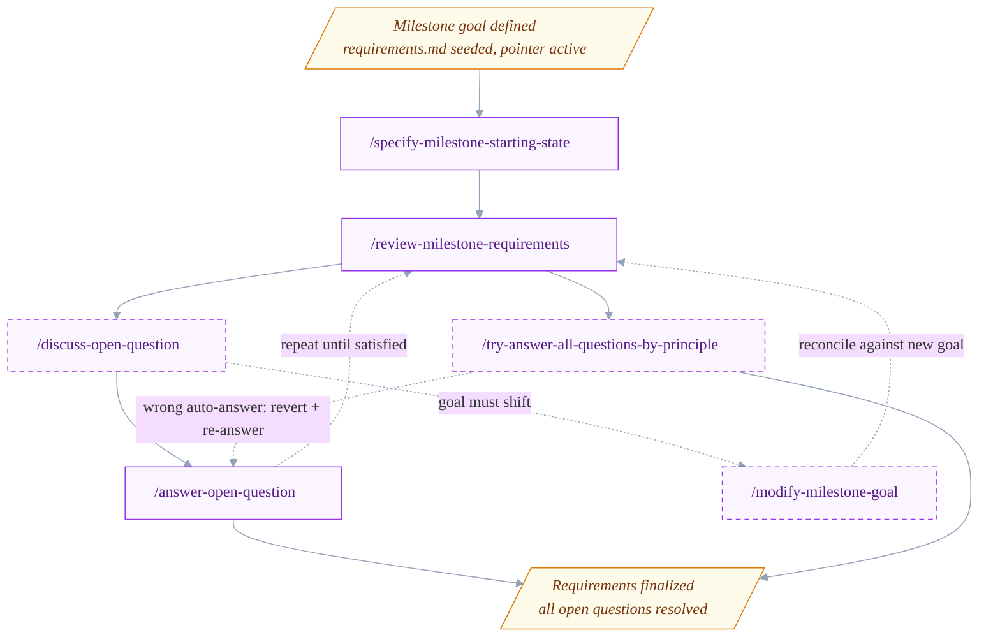
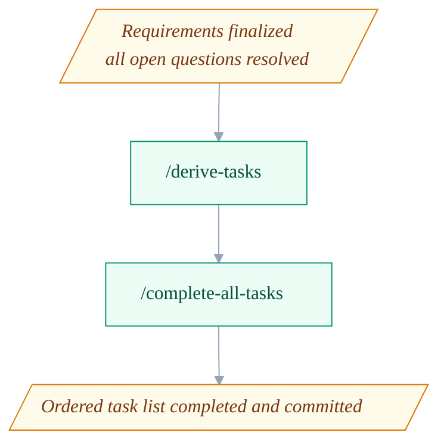
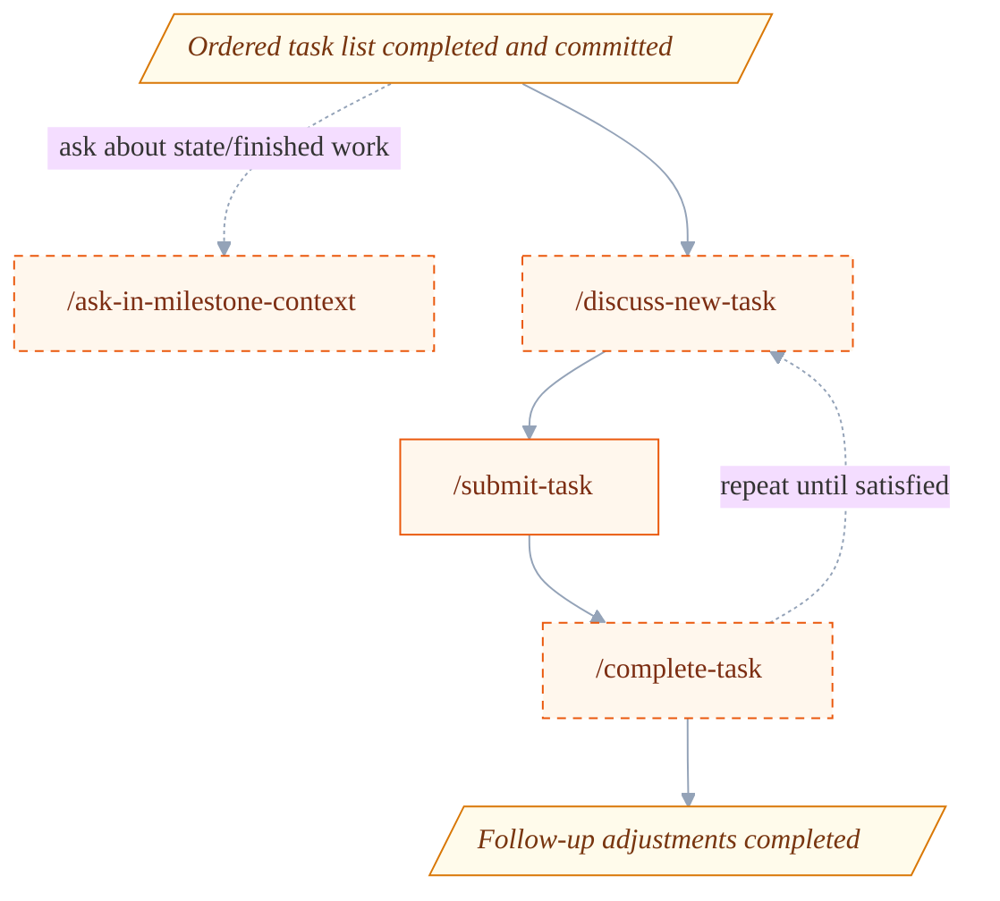
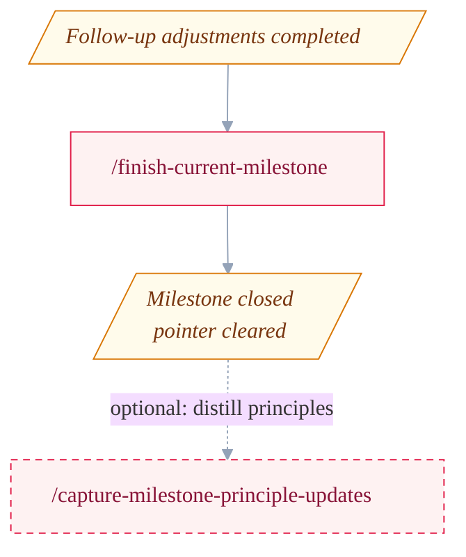

<p align="center">
    
</p>
<p align="center">
  <a href="https://github.com/uHappyLogic/cairn/releases/latest">
    
  </a>
  <a href="LICENSE">
    
  </a>
</p>

---

# Cairn

**Mark the path from idea to shipped.**
Milestone-driven development for any stack.

## Why Cairn?

Large-scale software projects fail in predictable ways: the goal drifts during planning, ambiguities pile up before coding starts, the task list grows unbounded, and there's no clear line between "working on it" and "done."

Cairn gives Claude Code a structured, repeatable process for moving an idea from rough goal to shipped code — one milestone at a time. Each milestone is a self-contained unit: you clarify the goal, resolve every open question, derive an ordered task list, complete the tasks, and close out the milestone before moving on. Nothing falls through the cracks because every decision is recorded and every requirement maps to a task.

It works with any tech stack. Skills read your project's environment (tooling, conventions, build commands) from `CLAUDE.md`, so the workflow adapts to whatever you're building.

## Installation

In any Claude Code project, run:

```
/plugin marketplace add uHappyLogic/cairn
```

Then bootstrap the milestones scaffold once in your project root:

```
/init-milestone-base-workflow
```

Run `/init` to document your project's tech stack and tooling in `CLAUDE.md` so skills can read the environment context.

## How it works

Each milestone lives in `milestones/milestone_<N>_<slug>/` and contains three files:

- `requirements.md` — goal, relevant starting state, decisions, and open questions
- `TASKS_TODO.md` — pending tasks ordered by priority (highest first)
- `TASKS_DONE.md` — completed tasks appended in the same format

`milestones/README.md` is the source of truth for which milestone is active. Skills read and write the current-milestone pointer there; it is never ambiguous which milestone is open.

## Workflow pipeline

The workflow runs as a stack of six phases. Each phase is its own diagram below, and the amber parallelogram **state** nodes (`D0`–`D5`) are the seams: every phase ends on the state node that the next phase begins with, so the shared node repeats at each boundary and the whole sequence reads top-to-bottom. Node labels are bare skill names — see the [Skill reference](#skill-reference) for what each one does. Dashed nodes and edges are optional or repeated steps.

### One-time setup

Run once per project, before any milestone work. `/init` records the tech stack and tooling in `CLAUDE.md`; `/init-milestone-base-workflow` creates the `milestones/` scaffold and seeds the current-milestone pointer — leaving the workflow scaffold ready.



### Initializing a milestone

From a ready scaffold — or looping back from a just-closed milestone (the dashed **next milestone** entry from `D5`) — shape and open the next milestone. `/discuss-milestone-goal` optionally sharpens a vague idea, `/define-milestone-goal` creates the milestone directory and seeds `requirements.md`, and `/goto-next-milestone` advances the pointer — leaving the milestone goal defined.



### Iterating milestone requirements

Drive `requirements.md` to convergence. `/specify-milestone-starting-state` fills the starting state from the codebase, then `/review-milestone-requirements` runs each pass to reconcile, surface new gaps, and check convergence (repeat until satisfied). Questions are explored with `/discuss-open-question` and recorded with `/answer-open-question`, which commits each answer with its rationale in the commit body (the reusable principle behind it is distilled later, at milestone finish). When a discussion concludes the milestone goal itself must shift, `/discuss-open-question` offers `/modify-milestone-goal` to revise the `## Goal` (then loop back through review to reconcile). The optional `/try-answer-all-questions-by-principle` sweep auto-answers what a confirmed principle settles; a wrong auto-answer is corrected by reverting its commit and re-running `/answer-open-question` — until every open question is resolved.



### Automated one-shot task derivation and completion

Hands-off execution. `/derive-tasks` converts the finalized `requirements.md` into an ordered `TASKS_TODO.md`, and `/complete-all-tasks` works through the list, committing after each task — leaving the ordered task list completed.



### Semi-manual follow-up and adjustments

Inline, conversational adjustments after the automated pass. `/ask-in-milestone-context` answers read-only questions about the milestone at any time; `/discuss-new-task` clarifies a mid-flight issue into briefs that hand off to `/submit-task`; and `/complete-task` completes a single task inline (repeat until satisfied) with the conversation kept for follow-up tweaks — leaving the follow-up adjustments completed.



### Ending a milestone

Close out. `/finish-current-milestone` records accomplishments and clears the pointer, leaving the milestone closed. It then recommends the optional `/capture-milestone-principle-updates`, which distills reusable answering principles from the just-finished milestone's recorded answers into the principle store. From `D5` the loop returns to **Initializing a milestone** for the next one.



## Skill reference

### `init-milestone-base-workflow`

One-time bootstrap for a project. Creates the `milestones/` directory and `milestones/README.md` with the current-milestone pointer, and ensures `CLAUDE.md` carries the `## Milestone Workflow` guidance. Additive and idempotent — creates missing scaffolding and inserts missing sections into existing files, never overwrites existing content. Run this before any other workflow skill.

### `discuss-milestone-goal <overall_goal_description>`

Facilitates a structured conversation to sharpen a vague goal into a clear, actionable statement. Produces a refined goal description ready for `/define-milestone-goal`. Creates no files.

### `define-milestone-goal <overall_goal_description>`

Creates a new `milestones/milestone_<N>_<slug>/` directory with `requirements.md` (Goal section filled), plus empty `TASKS_TODO.md` and `TASKS_DONE.md`. Does **not** activate the milestone.

### `specify-milestone-starting-state <milestone_id>`

Reads the milestone goal, explores the project using the environment documented in `CLAUDE.md`, and writes a concise technical summary into the `## Relevant starting state` section of `requirements.md`. Sets up the context needed to make informed decisions.

### `review-milestone-requirements`

The repeatable engine of the requirements-iteration loop. Each pass over the current milestone's `requirements.md` does three jobs: **reconciles** the existing question set against what's already decided (prunes a block a recorded decision now covers, dedups repeats), **surfaces** genuinely new gaps the latest decisions exposed, and **reports convergence** — whether any `Open question` blocks remain (which `/derive-tasks` forbids) or the requirements are ready to derive tasks. Run it after `/specify-milestone-starting-state` to open the questions, then re-run after every answer or two — earlier answers keep opening new ones. It never answers questions or records decisions itself; it shapes and reports the open-questions state for the answering skills to resolve.

### The answer-principle-learning loop

Open questions get resolved two ways, and the project *learns* from every manual answer. Confirmed answering principles accumulate in `milestones/answer_decision_principles.md` — a single project-wide store at the `milestones/` **root**, above any one milestone, so principles carry across milestones. Each principle is a reusable keep/eliminate directive that future autonomous answers can apply.

- **Manual teaching flow** — `/discuss-open-question → /answer-open-question`. You deliberate a question and record the answer; `answer-open-question` commits the decision with its rationale in the commit body. The reusable rule behind it isn't generalized on the spot — it is distilled later, at milestone finish, by `/capture-milestone-principle-updates`, which walks the milestone's `Manual-answer:` commits and confirms each principle with you before writing it to the store.
- **Autonomous sweep** — `/try-answer-all-questions-by-principle` re-sweeps the requirements and auto-answers exactly the questions those confirmed principles already settle, one traceable commit per answer.
- **Correction loop** — there is no dedicated correction skill. If the sweep gets one wrong, revert its commit (which reopens the question) and re-run `/answer-open-question`. The offending principle is reconciled at milestone finish, when `/capture-milestone-principle-updates` offers the re-answer's rationale as a revision of the bad principle.

### `discuss-open-question <question_name>`

Opens a structured conversation about a named open question in `requirements.md`. Surfaces alternatives, trade-offs, and a recommendation to help reach a decision.

### `answer-open-question <question_name>`

Records the resolution of a named open question in `requirements.md`, updating the document to reflect the decision and its downstream implications, then **commits** that edit. The commit stages only its own `requirements.md` change (`git add <MILESTONE_DIR>/requirements.md`, never `git add -A`) under the subject `Manual-answer: <Short Title>`, with the decision's rationale in the commit body and no `Answer-Principle:` trailer. It no longer chains to any capture skill — the reusable principle behind the answer is distilled later by `/capture-milestone-principle-updates` at milestone finish. This is the one individual skill that deliberately commits.

### `modify-milestone-goal <new or revised goal text>`

Revises the `## Goal` of the **already-defined** current milestone — the one skill that mutates the goal of a live milestone (`define-milestone-goal` only seeds it at creation). **Act-only**: it edits the Goal section and nothing else, then *surfaces* the downstream impact (which decisions, open questions, out-of-scope entries, and already-derived tasks the new goal may invalidate) and points you at `/review-milestone-requirements` to reconcile — it never cascades those changes itself. Offered by `/discuss-open-question` when a deliberation concludes the goal must shift, and directly invocable. Does not commit.

### `capture-milestone-principle-updates`

The **finish-time** principle harvester — the **sole writer** of the project-wide principle store `milestones/answer_decision_principles.md`. Run it as the optional follow-up `/finish-current-milestone` recommends, *after* the milestone is closed and the pointer cleared. It resolves the just-finished milestone from the last row of the `## Completed Milestones` table (not the current-milestone pointer, which is already `none`), walks that milestone's `Manual-answer:` commits (`git log --grep='^Manual-answer: ' -- <MILESTONE_DIR>/requirements.md`, excluding any sweep auto-answer that carries an `Answer-Principle:` trailer), and distills the rationale in those commit bodies into reusable keep/eliminate directives. It dedups the candidates against each other, then walks them strongest-first, confirming each with you one at a time — revise an overlapping existing principle or add a new one against the live store — and re-scans the pool after every write. An empty range or a set that none generalize both yield the same single-line "nothing to distill" report. It leaves its edit **staged**, never commits.

### `try-answer-all-questions-by-principle`

The autonomous sweep. Re-reads every open and deferred question in the current milestone's `requirements.md` and answers exactly those a confirmed principle already settles, by **candidate elimination** — enumerate the realistic answers, keep only those a confirmed principle supports, and auto-answer only when a single survivor remains. Requires a clean working tree, and commits **one auto-answer per commit**: subject `Principle-based-answer: <question>`, with each applied principle named in an `Answer-Principle:` trailer line. It is a pure orchestrator — it dispatches the read-only `try-answer-question-by-principle` subagent per question and owns all recording and committing. On a fresh project with no principles taught yet, it resolves nothing.

### `try-answer-question-by-principle` (subagent)

Read-only candidate-elimination subagent dispatched once per question by `/try-answer-all-questions-by-principle` — not user-invocable. Reads the principle store, enumerates the realistic candidate answers, keeps only those a confirmed principle supports, and returns a verdict naming the unique survivor (if any) and the load-bearing principles. It mutates nothing; the orchestrator owns all document edits and commits.

### `derive-tasks`

Converts the current milestone's `requirements.md` into `TASKS_TODO.md` — a complete, dependency-ordered list of atomic, AI-executable tasks. Decomposes the milestone into high-level briefs, proves every requirement is covered, then delegates detailed task authoring to the `submit-task` agent. Requires all open questions to be resolved first.

### `discuss-new-task <issue description>`

Clarifies a rough or oversized issue discovered mid-flight into one or more clear, task-sized briefs through a short conversation, then hands each off to `/submit-task`. Use it when the affected system, desired behavior, or verification isn't yet clear, or when one issue is really several tasks.

### `submit-task <issue description>`

Adds a single, already-clear issue to `TASKS_TODO.md`. Triages for duplicates and decides where the task belongs, then authors and inserts the task **inline, in the current conversation** so the authoring context stays available for follow-up tweaks. For vague or multi-task issues, route through `/discuss-new-task` first.

### `complete-all-tasks`

Orchestrator: completes all tasks in `TASKS_TODO.md` top to bottom, spawning one subagent per task and committing after each success. Stops on first failure.

### `complete-task <task_name>`

Completes a single named task from `TASKS_TODO.md` **inline, in the current conversation**. Running inline keeps the work context (what changed, why, how it was verified) in the conversation so you can ask follow-up questions or request tweaks right after. Changes are left staged — use `/complete-all-tasks` to complete the whole task list unattended with automatic commits.

### `ask-in-milestone-context <question>`

Answers a free-form, informational question about the current milestone — its goal, recorded decisions, done and pending tasks, and the actual code those tasks produced — grounding the answer in the live files and source rather than memory. **Read-only and conversational**, usable any time: use it to look back on finished work ("how did task X end up handling Y?", "where did we put Z?"), to take stock ("what's left and why?"), or to surface context before deciding what to do next. When the answer reveals a concrete next step, it offers the right skill — `/discuss-open-question`, `/submit-task` or `/discuss-new-task`, `/discuss-milestone-goal`, `/complete-task` — but performs none of their work itself.

### `finish-current-milestone`

Verifies all tasks are done, writes a completion summary to `milestones/README.md`, and updates `CLAUDE.md` only for lasting tech-stack or structural changes. Clears the current-milestone pointer — run `/goto-next-milestone` after.

### `goto-next-milestone <number> <title>`

Creates the next milestone directory with empty starter files and updates the current-milestone pointer in `milestones/README.md`. Only runnable after `/finish-current-milestone` has cleared the active pointer.

## Self-dogfooding

This repository runs its own workflow on itself. The `milestones/` directory, `milestones/README.md`, and the active milestone directory (`milestones/milestone_04_readme-pipeline-diagrams/`) are live workflow artifacts produced by Cairn's own skills — the requirements, task list, and completed tasks for the current milestone are all right there in the repo. If you want to see what a real milestone looks like end-to-end, look no further.

## License

MIT — see [LICENSE](LICENSE).
