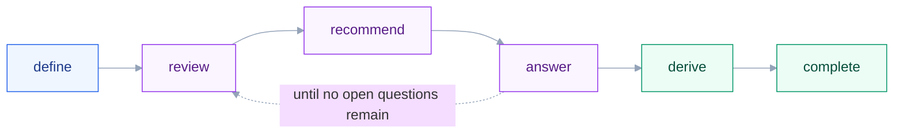

<p align="center">
  <a href="https://github.com/uHappyLogic/cairn/releases/latest">
    
  </a>
  <a href="https://github.com/uHappyLogic/cairn/actions/workflows/drift-gate.yml?query=branch%3Amain">
    
  </a>
  <a href="LICENSE">
    
  </a>
</p>

| repository | unique views | unique clones |
| --- | --- | --- |
| [uHappyLogic/cairn](https://github.com/uHappyLogic/cairn) | [](https://github.com/uHappyLogic/cairn/tree/traffic-data) | [](https://github.com/uHappyLogic/cairn/tree/traffic-data) |
| [uHappyLogic/cairn-claude](https://github.com/uHappyLogic/cairn-claude) | [](https://github.com/uHappyLogic/cairn-claude/tree/traffic-data) | [](https://github.com/uHappyLogic/cairn-claude/tree/traffic-data) |
| [uHappyLogic/cairn-antigravity](https://github.com/uHappyLogic/cairn-antigravity) | [](https://github.com/uHappyLogic/cairn-antigravity/tree/traffic-data) | [](https://github.com/uHappyLogic/cairn-antigravity/tree/traffic-data) |

---

# Cairn

**Mark the path from idea to shipped.**
Milestone-driven development for your coding agent — any kind of work, one milestone at a time.


```mermaid
%%{init: {'theme':'base','themeVariables':{'fontFamily':'ui-sans-serif, system-ui','lineColor':'#94a3b8','primaryBorderColor':'#475569'},'flowchart':{'wrappingWidth':9999,'curve':'basis'}}}%%
flowchart LR
    define["define"]
    review["review"]
    recommend["recommend"]
    answer["answer"]
    derive["derive"]
    complete["complete"]

    define --> review --> recommend --> answer --> derive --> complete
    answer -.->|until no open questions remain| review

    classDef init fill:#eff6ff,stroke:#2563eb,color:#1e3a8a;
    classDef req fill:#faf5ff,stroke:#9333ea,color:#581c87;
    classDef auto fill:#ecfdf5,stroke:#059669,color:#064e3b;
    class define init;
    class review,recommend,answer req;
    class derive,complete auto;
```

## Installation

### Claude Code

```
/plugin marketplace add uHappyLogic/cairn-claude
/plugin install cairn@cairn
```

### Antigravity

From your project root, extract the latest release into `.agents/plugins/cairn`, the path Antigravity loads the plugin from:

```bash
mkdir -p .agents/plugins/cairn
curl -sL https://github.com/uHappyLogic/cairn-antigravity/archive/refs/heads/main.tar.gz | tar -xz --strip-components=1 -C .agents/plugins/cairn
```

### Bootstrap your project

Then, in your project root, create the milestones scaffold once:

```
/init-milestone-base-workflow
```

Run `/init` to document your project — its domain context, working conventions, available tools, and how work is verified as done — in `CLAUDE.md`, so the skills can read that environment context.

## Why Cairn?

Large, ambitious projects fail in predictable ways: the goal drifts during planning, ambiguities pile up before the work starts, the task list grows unbounded, and there's no clear line between "working on it" and "done."

Cairn gives your coding agent a structured, repeatable process for moving an idea from rough goal to finished deliverable — one milestone at a time. Each milestone is a self-contained unit: you clarify the goal, resolve every open question, derive an ordered task list, complete the tasks, and close out the milestone before moving on. Nothing falls through the cracks because every decision is recorded and every requirement maps to a task.

It works with any kind of project. Skills read your project's environment — its domain context, working conventions, available tools, and how work is verified as done — from `CLAUDE.md`, so the workflow adapts to whatever you're producing.

## Design principles

- **[The records are machine-readable.](docs/design-claims.md#11-the-records-are-machine-readable)** Open questions are XML blocks in one section, found by their boundary lines, so every answer, cascade, and prune is a deterministic line-range edit.
- **[Each decision has a record in git.](docs/design-claims.md#2-each-decision-has-a-record-in-git)** One answer is one path-scoped commit whose subject marks how it was made — manual, recommendation, or alternative — so the log is provenance and a revert reopens the question.
- **[Advice gets better with each milestone.](docs/design-claims.md#5-advice-gets-better-with-each-milestone)** When you override a recommendation, the capture skill distills your reason into a project-wide principle store the recommender reads and cites on every later question.

All nineteen claims, each with its design and a metric to test it, are in [docs/design-claims.md](docs/design-claims.md).

## How it works

Each milestone lives in `milestones/milestone_<N>_<slug>/` and contains three files:

- `requirements.md` — goal, relevant starting state, decisions, and open questions
- `TASKS_TODO.md` — pending tasks ordered by priority (highest first)
- `TASKS_DONE.md` — completed tasks in the same section format, each entry augmented with the acceptance bar the completer derived and verified the work against, recorded as a `**Verified:**` bullet list (one bullet per criterion)

`milestones/README.md` is the source of truth for which milestone is active. Skills read and write the current-milestone pointer there; it is never ambiguous which milestone is open.

How the skills move a milestone through those files is described in [docs/workflow.md](docs/workflow.md), and what each skill does is in [docs/skill-reference.md](docs/skill-reference.md).

## Self-dogfooding

This repository runs its own workflow on itself. The `milestones/` directory and `milestones/README.md` are live workflow artifacts produced by Cairn's own skills — the requirements, task list, and completed tasks for the current milestone are all right there in the repo. If you want to see what a real milestone looks like end-to-end, look no further.

## Contributing

Cairn is authored once under `core/` and every `hosts/<host>/` tree is rebuilt from it, never hand-edited — see [CONTRIBUTING.md](CONTRIBUTING.md) for the full contributor path, from proposal to pull request.

- Bug reports and proposals — file them through the [issue forms](https://github.com/uHappyLogic/cairn/issues/new/choose).
- Questions — ask in [Discussions](https://github.com/uHappyLogic/cairn/discussions/new?category=q-a).
- Vulnerabilities — report them privately as [SECURITY.md](SECURITY.md) describes, never in an issue.
- Release notes — every release's notes, verbatim, in [CHANGELOG.md](CHANGELOG.md).

## License

MIT — see [LICENSE](LICENSE).
