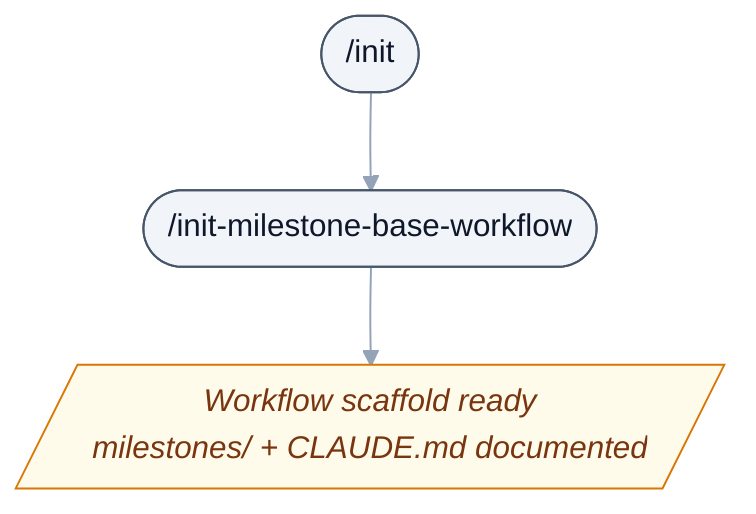
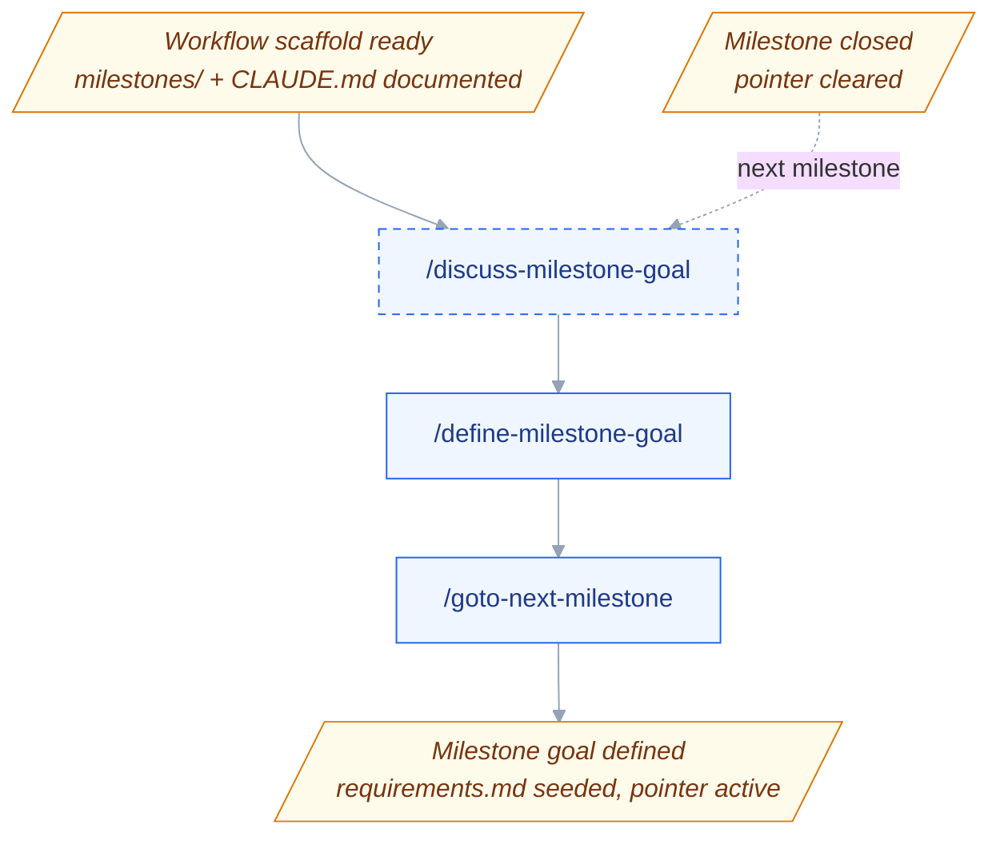
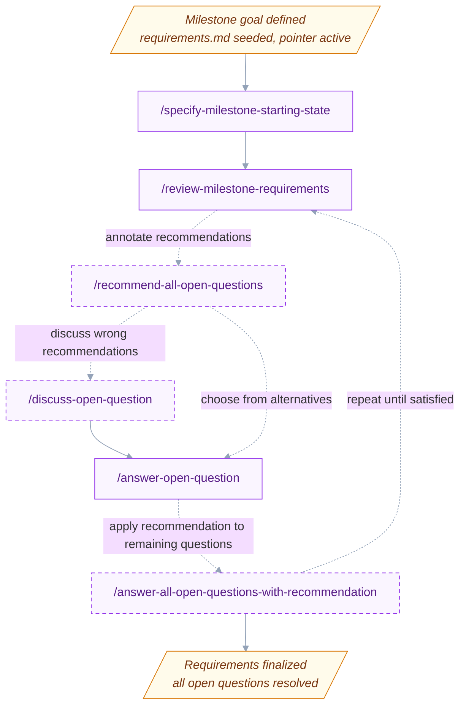
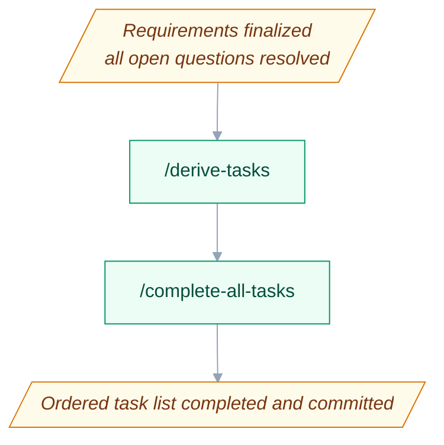
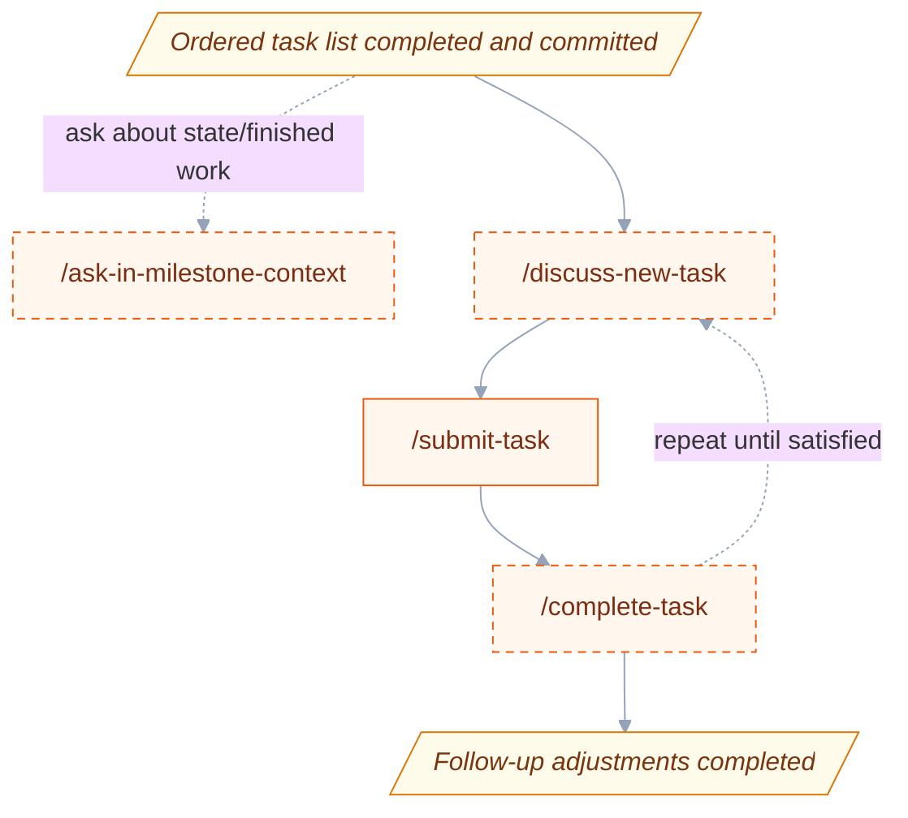
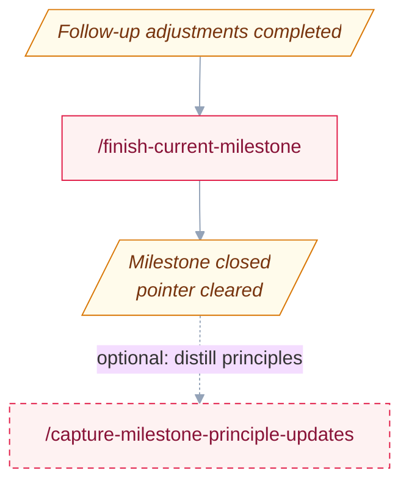

<p align="center">
    
</p>
<p align="center">
  <a href="https://github.com/uHappyLogic/cairn/releases/latest">
    
  </a>
  <a href="LICENSE">
    
  </a>
</p>

---

# Cairn

**Mark the path from idea to shipped.**
Milestone-driven development for any kind of work.

## Why Cairn?

Large, ambitious projects fail in predictable ways: the goal drifts during planning, ambiguities pile up before the work starts, the task list grows unbounded, and there's no clear line between "working on it" and "done."

Cairn gives Claude Code a structured, repeatable process for moving an idea from rough goal to finished deliverable — one milestone at a time. Each milestone is a self-contained unit: you clarify the goal, resolve every open question, derive an ordered task list, complete the tasks, and close out the milestone before moving on. Nothing falls through the cracks because every decision is recorded and every requirement maps to a task.

It works with any kind of project. Skills read your project's environment — its domain context, working conventions, available tools, and how work is verified as done — from `CLAUDE.md`, so the workflow adapts to whatever you're producing.

## Installation

In any Claude Code project, run:

```
/plugin marketplace add uHappyLogic/cairn
```

Then bootstrap the milestones scaffold once in your project root:

```
/init-milestone-base-workflow
```

Run `/init` to document your project — its domain context, working conventions, available tools, and how work is verified as done — in `CLAUDE.md` so skills can read the environment context.

## How it works

Each milestone lives in `milestones/milestone_<N>_<slug>/` and contains three files:

- `requirements.md` — goal, relevant starting state, decisions, and open questions
- `TASKS_TODO.md` — pending tasks ordered by priority (highest first)
- `TASKS_DONE.md` — completed tasks in the same section format, each entry augmented with the acceptance bar the completer derived and verified the work against, recorded as a `**Verified:**` bullet list (one bullet per criterion)

`milestones/README.md` is the source of truth for which milestone is active. Skills read and write the current-milestone pointer there; it is never ambiguous which milestone is open.

## Workflow pipeline

The workflow runs as a stack of six phases. Each phase is its own diagram below, and the amber parallelogram **state** nodes (`D0`–`D5`) are the seams: every phase ends on the state node that the next phase begins with, so the shared node repeats at each boundary and the whole sequence reads top-to-bottom. Node labels are bare skill names — see the [Skill reference](#skill-reference) for what each one does. Dashed nodes and edges are optional or repeated steps.

### One-time setup

Run once per project, before any milestone work. `/init` records the project's domain context, working conventions, available tools, and how work is verified as done in `CLAUDE.md`; `/init-milestone-base-workflow` creates the `milestones/` scaffold and seeds the current-milestone pointer — leaving the workflow scaffold ready.


```mermaid
%%{init: {'theme':'base','themeVariables':{'fontFamily':'ui-sans-serif, system-ui','lineColor':'#94a3b8','primaryBorderColor':'#475569'},'flowchart':{'wrappingWidth':9999,'curve':'basis'}}}%%
flowchart TD
    OT1(["/init"])
    OT2(["/init-milestone-base-workflow"])
    D0[/"Workflow scaffold ready<br/>milestones/ + CLAUDE.md documented"/]

    OT1 --> OT2 --> D0

    classDef setup fill:#f1f5f9,stroke:#475569,color:#0f172a;
    classDef state fill:#fffbeb,stroke:#d97706,color:#78350f,font-style:italic;
    class OT1,OT2 setup;
    class D0 state;
```

### Initializing a milestone

From a ready scaffold — or looping back from a just-closed milestone (the dashed **next milestone** entry from `D5`) — shape and open the next milestone. `/discuss-milestone-goal` optionally sharpens a vague idea, `/define-milestone-goal` creates the milestone directory and seeds `requirements.md`, and `/goto-next-milestone` advances the pointer — leaving the milestone goal defined.


```mermaid
%%{init: {'theme':'base','themeVariables':{'fontFamily':'ui-sans-serif, system-ui','lineColor':'#94a3b8','primaryBorderColor':'#475569'},'flowchart':{'wrappingWidth':9999,'curve':'basis'}}}%%
flowchart TD
    D0[/"Workflow scaffold ready<br/>milestones/ + CLAUDE.md documented"/]
    IM1["/discuss-milestone-goal"]
    IM2["/define-milestone-goal"]
    IM3["/goto-next-milestone"]
    D5[/"Milestone closed<br/>pointer cleared"/]
    D1[/"Milestone goal defined<br/>requirements.md seeded, pointer active"/]

    D0 --> IM1 --> IM2 --> IM3 --> D1
    D5 -.->|next milestone| IM1

    classDef init fill:#eff6ff,stroke:#2563eb,color:#1e3a8a;
    classDef optional stroke-dasharray:5 4;
    classDef state fill:#fffbeb,stroke:#d97706,color:#78350f,font-style:italic;
    class IM1,IM2,IM3 init;
    class IM1 optional;
    class D0,D5,D1 state;
```

### Iterating milestone requirements

Drive `requirements.md` to convergence. Open questions live as `<open-question>` XML blocks under the `## Open questions` section — raw structured data rather than clean-rendering Markdown, a deliberate trade for deterministic queryability and future UI-parseability: the open-question skills locate, extract, and remove blocks through a dependency-free line-oriented CLI (`awk`/`sed`/`grep` keyed on the block boundary lines, never `xmllint`) and read the whole document only when an operation reasons across it (cascade analysis, reconciliation) — the query-where-it-pays convention. `/specify-milestone-starting-state` fills the starting state from the project's existing state, then `/review-milestone-requirements` authors each new question as an `<open-question>` block and runs each pass to reconcile, surface new gaps, and check convergence (repeat until satisfied). Questions are explored with `/discuss-open-question` and recorded with `/answer-open-question`, which commits each answer with its rationale in the commit body (the reusable principle behind it is distilled later, at milestone finish). When a discussion concludes the milestone goal itself must shift, `/discuss-open-question` offers `/modify-milestone-goal` to revise the `## Goal` (then loop back through review to reconcile). The optional `/recommend-all-open-questions` sweep is the batch form of `/discuss-open-question`: it embeds an alternatives-and-recommendation set of XML sub-elements into every open/deferred question's `<open-question>` block, whose `<recommendation>` element `/answer-open-question-with-recommendation` then lifts and records for a single question — or `/answer-all-open-questions-with-recommendation` records for every annotated question at once. To record a *different* embedded option than the recommended one, `/answer-open-question-with-alternative` lifts an `<alternative>` you name by its id instead. A wrong recorded answer is corrected by reverting its commit (which reopens the question) and re-recording — repeat until every open question is resolved.


```mermaid
%%{init: {'theme':'base','themeVariables':{'fontFamily':'ui-sans-serif, system-ui','lineColor':'#94a3b8','primaryBorderColor':'#475569'},'flowchart':{'wrappingWidth':9999,'curve':'basis'}}}%%
flowchart TD
    D1[/"Milestone goal defined<br/>requirements.md seeded, pointer active"/]
    ITM0["/specify-milestone-starting-state"]
    ITM1["/review-milestone-requirements"]
    ITM3["/discuss-open-question"]
    ITM4["/answer-open-question"]
    ITM5["/recommend-all-open-questions"]
    ITM8["/answer-all-open-questions-with-recommendation"]
    D2[/"Requirements finalized<br/>all open questions resolved"/]

    D1 --> ITM0 --> ITM1

    ITM1 -.->|annotate recommendations| ITM5
    ITM5 -.->|discuss wrong recommendations| ITM3 --> ITM4
    ITM5 -.->|choose from alternatives| ITM4

    ITM4 -.->|apply recommendation to remaining questions| ITM8

    ITM8 -.->|repeat until satisfied| ITM1

    ITM8 --> D2

    classDef req fill:#faf5ff,stroke:#9333ea,color:#581c87;
    classDef optional stroke-dasharray:5 4;
    classDef state fill:#fffbeb,stroke:#d97706,color:#78350f,font-style:italic;
    class ITM0,ITM1,ITM3,ITM4,ITM5,ITM6,ITM7,ITM8 req;
    class ITM3,ITM5,ITM8 optional;
    class D1,D2 state;
```

### Automated one-shot task derivation and completion

Hands-off execution. `/derive-tasks` converts the finalized `requirements.md` into an ordered `TASKS_TODO.md` — decomposing the milestone into briefs and writing them into the task list itself, in one pass, with no second authoring step — and `/complete-all-tasks` works through the list, committing after each task — leaving the ordered task list completed.


```mermaid
%%{init: {'theme':'base','themeVariables':{'fontFamily':'ui-sans-serif, system-ui','lineColor':'#94a3b8','primaryBorderColor':'#475569'},'flowchart':{'wrappingWidth':9999,'curve':'basis'}}}%%
flowchart TD
    D2[/"Requirements finalized<br/>all open questions resolved"/]
    AI1["/derive-tasks"]
    AI2["/complete-all-tasks"]
    D3[/"Ordered task list completed and committed"/]

    D2 --> AI1 --> AI2 --> D3

    classDef auto fill:#ecfdf5,stroke:#059669,color:#064e3b;
    classDef state fill:#fffbeb,stroke:#d97706,color:#78350f,font-style:italic;
    class AI1,AI2 auto;
    class D2,D3 state;
```

### Semi-manual follow-up and adjustments

Inline, conversational adjustments after the automated pass. `/ask-in-milestone-context` answers read-only questions about the milestone at any time; `/discuss-new-task` clarifies a mid-flight issue into briefs that hand off to `/submit-task`; and `/complete-task` completes a single task inline (repeat until satisfied) with the conversation kept for follow-up tweaks — leaving the follow-up adjustments completed.


```mermaid
%%{init: {'theme':'base','themeVariables':{'fontFamily':'ui-sans-serif, system-ui','lineColor':'#94a3b8','primaryBorderColor':'#475569'},'flowchart':{'wrappingWidth':9999,'curve':'basis'}}}%%
flowchart TD
    D3[/"Ordered task list completed and committed"/]
    SM0["/ask-in-milestone-context"]
    SM1["/discuss-new-task"]
    SM2["/submit-task"]
    SM3["/complete-task"]
    D4[/"Follow-up adjustments completed"/]

    D3 --> SM1
    D3 -.->|ask about state/finished work| SM0
    SM1 --> SM2 --> SM3
    SM3 -.->|repeat until satisfied| SM1
    SM3 --> D4

    classDef manual fill:#fff7ed,stroke:#ea580c,color:#7c2d12;
    classDef optional stroke-dasharray:5 4;
    classDef state fill:#fffbeb,stroke:#d97706,color:#78350f,font-style:italic;
    class SM0,SM1,SM2,SM3 manual;
    class SM0,SM1,SM3 optional;
    class D3,D4 state;
```

### Ending a milestone

Close out. `/finish-current-milestone` records accomplishments and clears the pointer, leaving the milestone closed. As an optional finish-time follow-up, `/capture-milestone-principle-updates` then distills reusable answering principles from the just-finished milestone's recorded answers into the principle store. From `D5` the loop returns to **Initializing a milestone** for the next one.


```mermaid
%%{init: {'theme':'base','themeVariables':{'fontFamily':'ui-sans-serif, system-ui','lineColor':'#94a3b8','primaryBorderColor':'#475569'},'flowchart':{'wrappingWidth':9999,'curve':'basis'}}}%%
flowchart TD
    D4[/"Follow-up adjustments completed"/]
    EM1["/finish-current-milestone"]
    D5[/"Milestone closed<br/>pointer cleared"/]
    EM2["/capture-milestone-principle-updates"]

    D4 --> EM1 --> D5
    D5 -.->|optional: distill principles| EM2

    classDef finish fill:#fef2f2,stroke:#e11d48,color:#881337;
    classDef optional stroke-dasharray:5 4;
    classDef state fill:#fffbeb,stroke:#d97706,color:#78350f,font-style:italic;
    class EM1,EM2 finish;
    class EM2 optional;
    class D4,D5 state;
```

## How skills commit

Committing is a property of the skill layer, so the workflow leaves a clean, self-describing git history without you staging anything by hand. **Every user-invoked skill that changes files ends by committing exactly those changes** — staged path-scoped (only the paths it touched, never `git add -A`) under its own distinct `<Marker>: <descriptor>` subject derived from what the skill does (`Manual-answer:`, `Task-completion:`, `Task-submission:`, `Requirements-review:`, `Goal-revision:`, `Milestone-finish:`, and so on). **Dispatched subagents never commit** — they stage their own change set path-scoped and return — and **an orchestrator commits the index its agent staged**, at its own granularity: `/complete-all-tasks` commits once per task, `/answer-all-open-questions-with-recommendation` once per answer, and `/recommend-all-open-questions` and `/derive-tasks` once at the end of the run. A pass that changes no file (for example a `/review-milestone-requirements` or `/capture-milestone-principle-updates` pass that finds nothing) commits nothing rather than creating an empty commit.

Two setup/maintenance skills are exempt and leave their changes **staged** for you instead — `/init-milestone-base-workflow` and `/migrate-workspace` — because the project they run in may not be a git repo or may want its own commit boundaries. The purely conversational skills (`/discuss-milestone-goal`, `/discuss-open-question`, `/discuss-new-task`, `/ask-in-milestone-context`) change no files and so never commit. The commit mechanics themselves — the no-op guard, the path-scoped staging, and the commit — live in one shared procedure, `shared/commit-procedure.md`, that every committing skill references; the two orchestrators that dispatch agents stage nothing themselves (their agent already did) and simply guard and commit the staged index. One subject family is load-bearing: only genuinely user-deliberated answers carry a `Manual-answer:` subject, and finish-time `/capture-milestone-principle-updates` harvests exactly those (`git log --grep='^Manual-answer: '`); every other subject stays clear of that grep by construction, so recommendation- and alternative-derived answers are never mistaken for hand-authored rationale.

## Skill reference

### `init-milestone-base-workflow`

One-time bootstrap for a project. Creates the `milestones/` directory and `milestones/README.md` with the current-milestone pointer, and ensures `CLAUDE.md` carries the `## Milestone Workflow` guidance. Additive and idempotent — creates missing scaffolding and inserts missing sections into existing files, never overwrites existing content. Run this before any other workflow skill.

### `discuss-milestone-goal <overall_goal_description>`

Facilitates a structured conversation to sharpen a vague goal into a clear, actionable statement. Produces a refined goal description ready for `/define-milestone-goal`. Creates no files.

### `define-milestone-goal <overall_goal_description>`

Creates a new `milestones/milestone_<N>_<slug>/` directory with `requirements.md` (Goal section filled), plus empty `TASKS_TODO.md` and `TASKS_DONE.md`. Does **not** activate the milestone.

### `specify-milestone-starting-state <milestone_id>`

Reads the milestone goal, explores the project's existing state using the environment documented in `CLAUDE.md`, and writes a concise summary into the `## Relevant starting state` section of `requirements.md`. Sets up the context needed to make informed decisions.

### `review-milestone-requirements`

The repeatable engine of the requirements-iteration loop. Each pass over the current milestone's `requirements.md` does three jobs: **reconciles** the existing question set against what's already decided (prunes a block a recorded decision now covers, dedups repeats), **surfaces** genuinely new gaps the latest decisions exposed, and **reports convergence** — whether any `status="open"` blocks remain (which `/derive-tasks` forbids) or the requirements are ready to derive tasks (`status="deferred"` blocks may carry forward). Run it after `/specify-milestone-starting-state` to open the questions, then re-run after every answer or two — earlier answers keep opening new ones. It never answers questions or records decisions itself; it shapes and reports the open-questions state for the answering skills to resolve.

### The answer-principle-learning loop

Open questions get resolved through deliberation, and the project *learns* from every manual answer. Confirmed answering principles accumulate in `milestones/answer_decision_principles.md` — a single project-wide store at the `milestones/` **root**, above any one milestone, so principles carry across milestones. Each principle is a reusable keep/eliminate directive that, once confirmed, feeds the principle-aware recommendation core `shared/recommend-procedure.md` as a **weighted advisory factor**.

- **Manual teaching flow** — `/discuss-open-question → /answer-open-question`. You deliberate a question and record the answer; `answer-open-question` commits the decision with its rationale in the commit body. The reusable rule behind it isn't generalized on the spot — it is distilled later, at milestone finish, by `/capture-milestone-principle-updates`, which walks the milestone's `Manual-answer:` commits and confirms each principle with you before writing it to the store.
- **Recommendation advisory** — once confirmed, a principle that bears on a question becomes a **weighted advisory factor** in the shared recommendation core `shared/recommend-procedure.md` — read in place by both `/discuss-open-question` and `/recommend-all-open-questions`'s `recommend-open-question` agent. It is a strong default in favor of the option it supports (merit may override it only for a specifically stated reason), and it is **cited** whenever it steered the recommended pick — the agent renders each bearing principle as its own `<applied-principle>` element, a sibling of the block's `<recommendation option="...">` element (never baked into the recommendation text, so the lifted answer stays provenance-free). Principles advise recommendations; they never auto-answer.
- **Correction loop** — there is no dedicated correction skill. To correct a wrong recorded answer, revert its commit (which reopens the question) and re-record via `/answer-open-question`. Because a confirmed principle is now only a weighted advisory factor cited in recommendations — never a binding auto-answer — a principle that steered a recommendation wrong is reconciled at milestone finish, when `/capture-milestone-principle-updates` offers the re-answer's rationale as a revision of the bad principle.

### `discuss-open-question <question_name>`

Opens a structured conversation about a named open question in `requirements.md`. Surfaces alternatives, trade-offs, and a recommendation to help reach a decision. The analytical core — the realistic alternatives and the single recommendation — is sourced from the shared `shared/recommend-procedure.md` (the same core the `/recommend-all-open-questions` sweep uses), and the skill adds its own conversational layer on top: a "what would change your mind" section and the continue-the-conversation loop. Purely conversational — it edits nothing.

### `answer-open-question <question_name>`

Records the resolution of a named open question in `requirements.md`, updating the document to reflect the decision and its downstream implications, then **commits** that edit. The commit stages only its own `requirements.md` change (`git add <MILESTONE_DIR>/requirements.md`, never `git add -A`) under the subject `Manual-answer: <Short Title>`, with the decision's rationale in the commit body. It no longer chains to any capture skill — the reusable principle behind the answer is distilled later by `/capture-milestone-principle-updates` at milestone finish. Its `Manual-answer:` subject is the one that finish-time capture harvests (`git log --grep='^Manual-answer: '`); every other committing skill's subject stays clear of that grep by construction (see [How skills commit](#how-skills-commit)).

The answer text is recorded **literally** — recording a question's embedded recommendation now lives in the dedicated `/answer-open-question-with-recommendation` skill. As migration scaffolding, this skill keeps one small **redirect guard**: if the answer text is exactly the retired sentinel `record the recommendation` (whole-string, after trim + lowercase, never a substring), it stops without recording and points you at `/answer-open-question-with-recommendation` instead of committing the sentinel phrase as a decision.

### `answer-open-question-with-recommendation <question_name>`

Records a named open question's **embedded recommendation** as its answer, then **commits** — the dedicated home for the recording logic extracted out of `/answer-open-question`. It lifts the `<recommendation option="...">` element that `/recommend-all-open-questions` embedded in the question's `<open-question>` block — recombining its `option` attribute and text into the `<option> — <rationale>` answer form with entities un-escaped — folds it into `## Decisions`, and cascades to any siblings the decision moots — exactly like a manual answer. The commit stages only its own `requirements.md` change (`git add <MILESTONE_DIR>/requirements.md`, never `git add -A`) under the distinct subject `Recommendation-answer: <Short Title>` — which the `Manual-answer:` grep of finish-time `/capture-milestone-principle-updates` never matches, so it is never harvested (its rationale is the recommend agent's, not user-deliberated). If the targeted `<open-question>` block carries no `<recommendation>` element (the sweep never ran, or the question was added afterward), it stops without changing anything and commits nothing. Runs **inline** in the conversation so the context survives for follow-up.

### `answer-open-question-with-alternative <question_name>. <alternative id>`

Records a **named `<alternative>`** from an open question's embedded analysis as its answer, then **commits** — the sibling of `/answer-open-question-with-recommendation`, differing only in *which* embedded element becomes the answer. Where the recommendation skill lifts the one `<recommendation>` element the sweep picked, this skill lifts the `<alternative id="...">` **you** name — which lets you record a decision that *overrides* the recommendation, or resolve a question the sweep left genuinely tied. Split the argument on the **first `.`**: the Short Title before it, the target alternative's `id` after it (both case-insensitive, both trimmed). It recombines the chosen alternative's `id` and its what-it-is text into the `<id> — <what-it-is>` answer form with entities un-escaped (the `<advantage>`/`<drawback>` children are trade-off analysis, not the decision, and are left out), folds it into `## Decisions`, and cascades to any siblings the decision moots — exactly like a manual answer. The commit stages only its own `requirements.md` change (`git add <MILESTONE_DIR>/requirements.md`, never `git add -A`) under the distinct subject `Alternative-answer: <Short Title>` — which, like `Recommendation-answer:`, the `Manual-answer:` grep of finish-time `/capture-milestone-principle-updates` never matches, so it is never harvested (its rationale is the recommend agent's alternative text, not user-deliberated). If no question matches the Short Title, the block carries no `<alternative>` elements (the sweep never ran), or no alternative matches the given id, it stops without changing anything and commits nothing, listing the available ids. Runs **inline** in the conversation so the context survives for follow-up. There is deliberately **no** batch/agent form: which alternative wins is per-question human judgment, not a rule an orchestrator could sweep.

### `answer-all-open-questions-with-recommendation`

The **recommendation-answer sweep** — the batch form of `/answer-open-question-with-recommendation`, and the recording counterpart to `/recommend-all-open-questions`. It gathers every open and deferred `<open-question>` block carrying a `<recommendation>` element **once**, in most-significant-first order (a cascade-parent-first proxy), and dispatches the file-editing `answer-open-question-with-recommendation` agent **strictly sequentially** — re-reading `requirements.md` before each dispatch and skipping any question a prior answer's cascade already removed. The **agent** owns every edit and stages it, but does **not** commit; the **orchestrator commits that staged index itself** after the agent returns — **one commit per answer** under `Recommendation-answer: <Short Title>`, preserving one-commit-per-answer (the ordinary orchestrator-commits arrangement, as in `/complete-all-tasks`). It needs **no** clean-working-tree precondition — the agent's staging is path-scoped, so a dirty tree stays out of the per-answer commit. Run it after `/recommend-all-open-questions` to record every annotated recommendation at once.

### `answer-open-question-with-recommendation` (agent)

The isolated-context twin of the skill above, dispatched once per question by `/answer-all-open-questions-with-recommendation` — not user-invocable. It runs the same lift-and-record procedure in a throwaway subagent context, and — unlike the read-only `recommend-open-question` subagent — it **mutates** `requirements.md` to record the answer; but like every dispatched agent it does **not** commit — it stages that edit path-scoped and leaves it for the orchestrator to commit (once per answer, `Recommendation-answer: <Short Title>`), returning a bare `DONE`/`FAILED`.

### `modify-milestone-goal <new or revised goal text>`

Revises the `## Goal` of the **already-defined** current milestone — the one skill that mutates the goal of a live milestone (`define-milestone-goal` only seeds it at creation). **Act-only**: it edits the Goal section and nothing else and never cascades the downstream impact (which decisions, open questions, out-of-scope entries, and already-derived tasks the new goal may invalidate) — reconciling that impact is left to you, via `/review-milestone-requirements` afterward. Offered by `/discuss-open-question` when a deliberation concludes the goal must shift, and directly invocable. It commits its own Goal edit path-scoped under a `Goal-revision: <milestone_id>` subject.

### `capture-milestone-principle-updates`

The **finish-time** principle harvester — the **sole writer** of the project-wide principle store `milestones/answer_decision_principles.md`. Run it as the optional finish-time follow-up, *after* `/finish-current-milestone` has closed the milestone and cleared the pointer. It resolves the just-finished milestone from the last row of the `## Completed Milestones` table (not the current-milestone pointer, which is already `none`), walks that milestone's `Manual-answer:` commits (`git log --grep='^Manual-answer: ' -- <MILESTONE_DIR>/requirements.md`), and distills the rationale in those commit bodies into reusable keep/eliminate directives. It dedups the candidates against each other, then walks them strongest-first, confirming each with you one at a time — revise an overlapping existing principle or add a new one against the live store — and re-scans the pool after every write. An empty range or a set that none generalize both yield the same single-line "nothing to distill" report. It commits its principle-store edit path-scoped under a `Principle-capture: <milestone_id>` subject; a pass that distills nothing changes no file and so commits nothing.

### `recommend-all-open-questions`

The non-interactive **recommendation sweep** — the argument-free batch form of `/discuss-open-question`. It gathers every open and deferred `<open-question>` block in the current milestone's `requirements.md` **once** — via the boundary-line `awk`/`sed`/`grep` CLI over the single `## Open questions` section — dispatches one read-only `recommend-open-question` subagent per question, and is the **sole document mutator**: it embeds each returned set of child sub-elements (the `<alternative>` elements, any `<applied-principle>` elements, and the `<recommendation>` element) inside the existing `<open-question>` block by rewriting that block whole with a structural `Edit` — never a CLI splice — leaving the `<open-question …>` boundary tags and the `<question>` element unchanged. Because it records no decisions and triggers no cascades — the question set never shrinks under it — it needs none of the sequencing machinery a recording sweep requires: no gather-order, no per-question live-re-check, no re-gather loop, and no clean-working-tree precondition. It is **idempotent**: it skips any block that already contains a `<recommendation>` element and annotates only those lacking one (to force a fresh recommendation, delete that block's embedded `<alternative>`/`<applied-principle>`/`<recommendation>` children — leaving the `<open-question>` wrapper and `<question>` element intact — and re-run). It **commits its annotations once at the end of the run** — path-scoped to `<MILESTONE_DIR>/requirements.md` (never `git add -A`) under a `Recommendation-annotation: <milestone_id>` subject, and a sweep that annotated nothing commits nothing. The embedded recommendations are later lifted and recorded as decisions — under `Recommendation-answer:` — by `/answer-open-question-with-recommendation` (or the `/answer-all-open-questions-with-recommendation` sweep).

### `recommend-open-question` (subagent)

Read-only recommendation subagent dispatched once per question by `/recommend-all-open-questions` — not user-invocable, and the non-interactive twin of `/discuss-open-question`. Given one question's Short Title plus context, it grounds in the live project (read-only), enumerates the honest alternatives, and picks a single recommendation — sourcing that analytical core from the shared `shared/recommend-procedure.md` — then returns the ready-to-embed `<open-question>` child sub-elements — one `<alternative>` per option (each with child `<advantage>`/`<drawback>`), any `<applied-principle>` elements, and the single `<recommendation option="...">` element that `/answer-open-question-with-recommendation` later lifts — as its final message, never the `<open-question>` wrapper or `<question>` element (which the orchestrator owns). It mutates nothing; the orchestrator owns all embedding and staging.

### `derive-tasks`

Converts the current milestone's `requirements.md` into `TASKS_TODO.md` — a complete, dependency-ordered list of atomic, AI-completable **brief-level** tasks. Decomposes the milestone into high-level briefs, proves every requirement is covered with a traceability matrix, orders them by dependency, and writes those briefs into `TASKS_TODO.md` itself, in order, as the finished task sections. A brief and a task section are the same altitude, so writing the brief down *is* the authoring step: there is no second pass and nothing is handed off. Each section is a `##` title, a 1–3 sentence description of what is to be achieved, why the milestone needs it, and how it would be verified, and a trailing `---` — the completer derives the flow and the formal acceptance bar itself. Requires all open questions to be resolved first.

### `discuss-new-task <issue description>`

Clarifies a rough or oversized issue discovered mid-flight into one or more clear, task-sized briefs through a short conversation, then hands each off to `/submit-task`. Because tasks are brief-level, each brief maps near-1:1 onto the task section `/submit-task` writes — a title and a few sentences, with no further fleshing out. Use it when the affected system, desired behavior, or verification isn't yet clear, or when one issue is really several tasks.

### `submit-task <issue description>`

Adds a single, already-clear issue to `TASKS_TODO.md` as a **brief-level task section** — a `##` title, a 1–3 sentence description of what is to be achieved, why it is needed, and how it would be verified, and a trailing `---`, and nothing else. Triages for duplicates and decides where the task belongs, then authors and inserts the task **inline, in the current conversation** so the authoring context stays available for follow-up tweaks, and commits the inserted task path-scoped under a `Task-submission:` subject. It is the same format `/derive-tasks` writes, so every task in the list sits at one altitude. For vague or multi-task issues, route through `/discuss-new-task` first.

### `complete-all-tasks`

Orchestrator: completes all tasks in `TASKS_TODO.md` top to bottom, spawning one subagent per task and committing after each success — **once per task**, committing the index the agent staged (its change set, plus the two task-list files, never `git add -A`) under a `Tasklist-completion:` subject with the task heading in the commit **body**. Stops on first failure.

### `complete-task <task_name>`

Completes a single named task from `TASKS_TODO.md` **inline, in the current conversation**. Running inline keeps the work context (what changed, why, how it was verified) in the conversation so you can ask follow-up questions or request tweaks right after. It commits the task's change set path-scoped — the files it created or edited plus the two task-list files, never `git add -A` — under a `Task-completion:` subject. Use `/complete-all-tasks` to run the whole task list unattended.

### `ask-in-milestone-context <question>`

Answers a free-form, informational question about the current milestone — its goal, recorded decisions, done and pending tasks, and the actual deliverables those tasks produced — grounding the answer in the live files and artifacts rather than memory. **Read-only and conversational**, usable any time: use it to look back on finished work ("how did task X end up handling Y?", "where did we put Z?"), to take stock ("what's left and why?"), or to surface context before deciding what to do next. When the answer reveals a concrete next step, it offers the right skill — `/discuss-open-question`, `/submit-task` or `/discuss-new-task`, `/discuss-milestone-goal`, `/complete-task` — but performs none of their work itself.

### `finish-current-milestone`

Verifies all tasks are done, writes a completion summary to `milestones/README.md`, and updates `CLAUDE.md` only for lasting changes to the project's environment context. Clears the current-milestone pointer — run `/goto-next-milestone` after.

### `goto-next-milestone <number> <title>`

Creates the next milestone directory with empty starter files and updates the current-milestone pointer in `milestones/README.md`. Only runnable after `/finish-current-milestone` has cleared the active pointer.

## Development

This project supports both Claude Code and Google Antigravity. The canonical source files (e.g., `skills/`, `agents/`) are authored at the repository root and are written for Claude Code.

To build the plugin for Google Antigravity, run the local transpilation step from the repository root:

```bash
uv run scripts/migrate_skills_to_agy.py
```

This will parse the Claude Code plugin source and generate the Antigravity-compatible version under `.agents/plugins/cairn/`.

## Self-dogfooding

This repository runs its own workflow on itself. The `milestones/` directory and `milestones/README.md` are live workflow artifacts produced by Cairn's own skills — the requirements, task list, and completed tasks for the current milestone are all right there in the repo. If you want to see what a real milestone looks like end-to-end, look no further.

## License

MIT — see [LICENSE](LICENSE).
