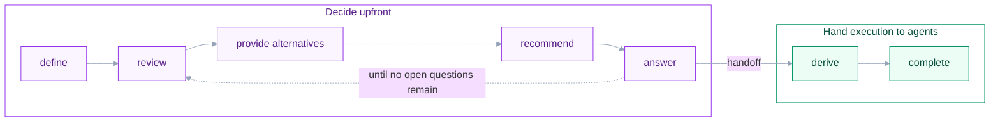

<p align="center">
  <a href="https://github.com/uHappyLogic/cairn/releases/latest">
    
  </a>
  <a href="https://github.com/uHappyLogic/cairn/actions/workflows/drift-gate.yml?query=branch%3Amain">
    
  </a>
  <a href="LICENSE">
    
  </a>
</p>

<div align="center">

| repository | unique views | unique clones |
| --- | --- | --- |
| [uHappyLogic/cairn](https://github.com/uHappyLogic/cairn) | [](https://github.com/uHappyLogic/cairn/tree/traffic-data) | [](https://github.com/uHappyLogic/cairn/tree/traffic-data) |
| [uHappyLogic/cairn-claude](https://github.com/uHappyLogic/cairn-claude) | [](https://github.com/uHappyLogic/cairn-claude/tree/traffic-data) | [](https://github.com/uHappyLogic/cairn-claude/tree/traffic-data) |
| [uHappyLogic/cairn-antigravity](https://github.com/uHappyLogic/cairn-antigravity) | [](https://github.com/uHappyLogic/cairn-antigravity/tree/traffic-data) | [](https://github.com/uHappyLogic/cairn-antigravity/tree/traffic-data) |
| [uHappyLogic/cairn-codex](https://github.com/uHappyLogic/cairn-codex) | [](https://github.com/uHappyLogic/cairn-codex/tree/traffic-data) | [](https://github.com/uHappyLogic/cairn-codex/tree/traffic-data) |

</div>

---

# Cairn

**Mark the path first, then hand off the walk.**
Cairn brings all the important questions up to be decided upfront, so you can hand long-running execution to your agent confidently.


```mermaid
%%{init: {'theme':'base','themeVariables':{'fontFamily':'ui-sans-serif, system-ui','lineColor':'#94a3b8','primaryBorderColor':'#475569'},'flowchart':{'wrappingWidth':9999,'curve':'basis'}}}%%
flowchart LR
    subgraph upfront["Decide upfront"]
        define["define"]
        review["review"]
        alternatives["provide alternatives"]
        recommend["recommend"]
        answer["answer"]
    end
    subgraph agents["Hand execution to agents"]
        derive["derive"]
        complete["complete"]
    end

    define --> review --> alternatives --> recommend --> answer
    answer -.->|until no open questions remain| review
    answer -->|handoff| derive
    derive --> complete

    classDef decide fill:#faf5ff,stroke:#9333ea,color:#581c87;
    classDef execute fill:#ecfdf5,stroke:#059669,color:#064e3b;
    class define,review,alternatives,recommend,answer decide;
    class derive,complete execute;
    style upfront fill:#ffffff,stroke:#9333ea,color:#581c87;
    style agents fill:#ffffff,stroke:#059669,color:#064e3b;
```

## Installation

Cairn has two runtime prerequisites: **git**, with your project root inside a git work tree that every skill commits into, and a **Python 3.9 or later** interpreter that answers as `python3` on your PATH. The skills drive the plugin's stdlib-only Python tools with it (no packages to install), and `/init-milestone-base-workflow` checks both once per project, git first, stopping with the remedy when either is missing.

### Claude Code

```
/plugin marketplace add uHappyLogic/cairn-claude
/plugin install cairn@cairn
```

### Antigravity

From your project root, extract the latest release into `.agents/plugins/cairn`, the path Antigravity loads the plugin from:

```bash
mkdir -p .agents/plugins/cairn
curl -sL https://github.com/uHappyLogic/cairn-antigravity/archive/refs/heads/main.tar.gz | tar -xz --strip-components=1 -C .agents/plugins/cairn
```

### Codex

Cairn supports the Codex command-line tool. In a terminal, add the `cairn-codex` marketplace and install the plugin from it:

```
codex plugin marketplace add uHappyLogic/cairn-codex
codex plugin add cairn@cairn
```

In a Codex session, invoke a skill by its name under the plugin's namespace, such as `$cairn:init-milestone-base-workflow`. The skills' own text names other skills in the slash form, such as `/derive-tasks`; those slash names refer to the same skills, which you invoke as `$cairn:derive-tasks`.

Codex reads its project instructions from `AGENTS.md`, so on Codex the skills read your project's environment context from `AGENTS.md`, and the bootstrap writes its workflow section there, never to `CLAUDE.md`.

Run your sessions under Codex's workspace-write sandbox with the on-request approval policy; Cairn needs no change to `config.toml`. That sandbox keeps your project's `.git` directory read-only, so every git staging or commit step a skill takes asks for your approval. The plugin's `python3` tools need only read access to the installed plugin directory.

### Bootstrap your project

Then, in your project root, create the milestones scaffold once:

```
/init-milestone-base-workflow
```

Run `/init` to document your project — its domain context, working conventions, available tools, and how work is verified as done — in `CLAUDE.md`, so the skills can read that environment context.

## Why Cairn?

Handing long-running execution to an agent breaks down in a predictable way. An agent left to run for a long time hits questions nobody decided, and it either guesses quietly and builds on the guess or stops and waits for a person. Either way, you cannot walk away.

Cairn works one milestone at a time, and the milestone is what makes the handoff possible. Each milestone first brings its open questions up, has them answered with recorded decisions, and only then derives tasks an agent can complete unattended. Bringing up all the important questions is the principle Cairn is built toward, not yet a measured result, and later milestones of Cairn's own development work toward it.

This holds for any kind of work. Skills read your project's environment — its domain context, working conventions, available tools, and how work is verified as done — from `CLAUDE.md`, so the same sequence fits whatever you're producing.

## Design principles

- **[The records are machine-readable.](docs/design-claims.md#11-the-records-are-machine-readable)** Open questions are one XML document per milestone, created empty with the milestone and written from then on only by the plugin's stdlib open-question tool, so every answer, cascade, and prune is a validated tool call that rewrites the document in one canonical form.
- **[Each decision has a record in git.](docs/design-claims.md#2-each-decision-has-a-record-in-git)** One answer is one path-scoped commit whose subject marks how it was made — manual, recommendation, or alternative — so the log is provenance and a revert reopens the question.
- **[Advice gets better with each milestone.](docs/design-claims.md#5-advice-gets-better-with-each-milestone)** When you override a recommendation, the capture skill distills your reason into a project-wide principle store the recommender reads and cites on every later question.

All nineteen claims, each with its design and a metric to test it, are in [docs/design-claims.md](docs/design-claims.md).

## How it works

Each milestone lives in `milestones/milestone_<N>_<slug>/` and contains four files:

- `requirements.md` — goal, relevant starting state, decisions, and out of scope, as prose Markdown
- `open_questions.xml` — the open questions, one `<open-question>` block each under a single `<open-questions>` root; created empty with the milestone and written only by the plugin's open-question tool, never by hand — the milestone's requirements have converged when no block remains
- `TASKS_TODO.md` — pending tasks ordered by priority (highest first)
- `TASKS_DONE.md` — completed tasks in the same section format, each entry augmented with the acceptance bar the completer derived and verified the work against, recorded as a `**Verified:**` bullet list (one bullet per criterion)

`milestones/README.md` is the source of truth for which milestone is active. Skills read and write the current-milestone pointer there; it is never ambiguous which milestone is open.

How the skills move a milestone through those files is described in [docs/workflow.md](docs/workflow.md), what each skill does is in [docs/skill-reference.md](docs/skill-reference.md), and how to chain the skills as headless command lines, mixing hosts, models, and effort levels, is in [docs/ways-of-using-cairn.md](docs/ways-of-using-cairn.md).

## Self-dogfooding

This repository runs its own workflow on itself. The `milestones/` directory and `milestones/README.md` are live workflow artifacts produced by Cairn's own skills — the requirements, task list, and completed tasks for the current milestone are all right there in the repo. If you want to see what a real milestone looks like end-to-end, look no further.

## Contributing

Cairn is authored once under `core/` and every `hosts/<host>/` tree is rebuilt from it, never hand-edited — see [CONTRIBUTING.md](CONTRIBUTING.md) for the full contributor path, from proposal to pull request.

- Bug reports and proposals — file them through the [issue forms](https://github.com/uHappyLogic/cairn/issues/new/choose).
- Questions — ask in [Discussions](https://github.com/uHappyLogic/cairn/discussions/new?category=q-a).
- Vulnerabilities — report them privately as [SECURITY.md](SECURITY.md) describes, never in an issue.
- Release notes — every release's notes, verbatim, in [CHANGELOG.md](CHANGELOG.md).

## License

MIT — see [LICENSE](LICENSE).
