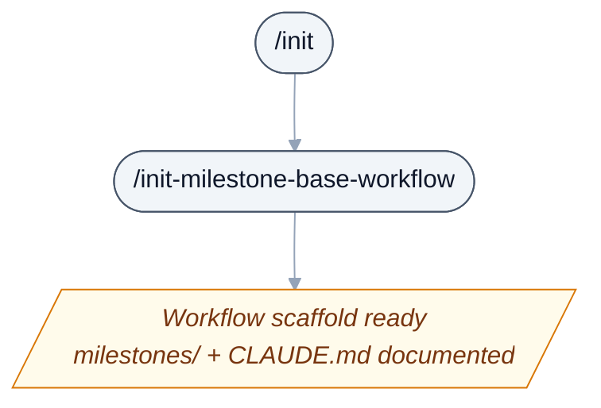
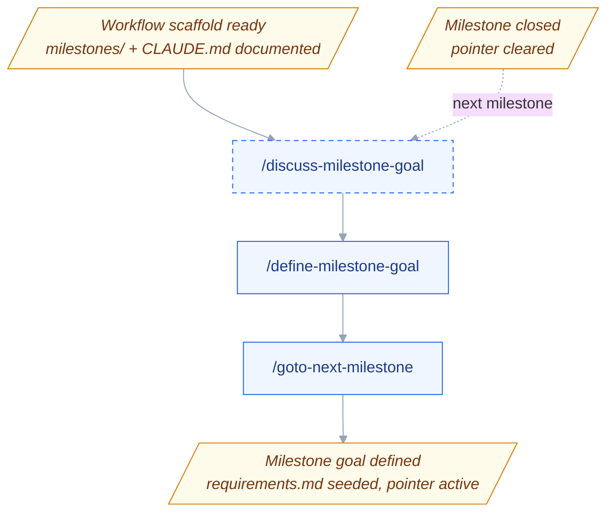
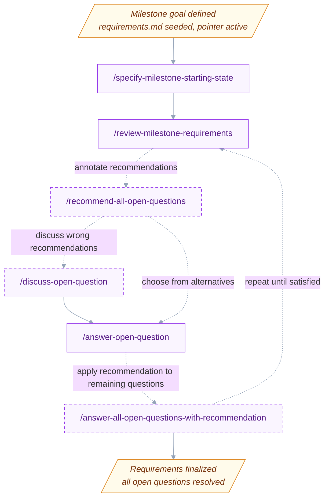
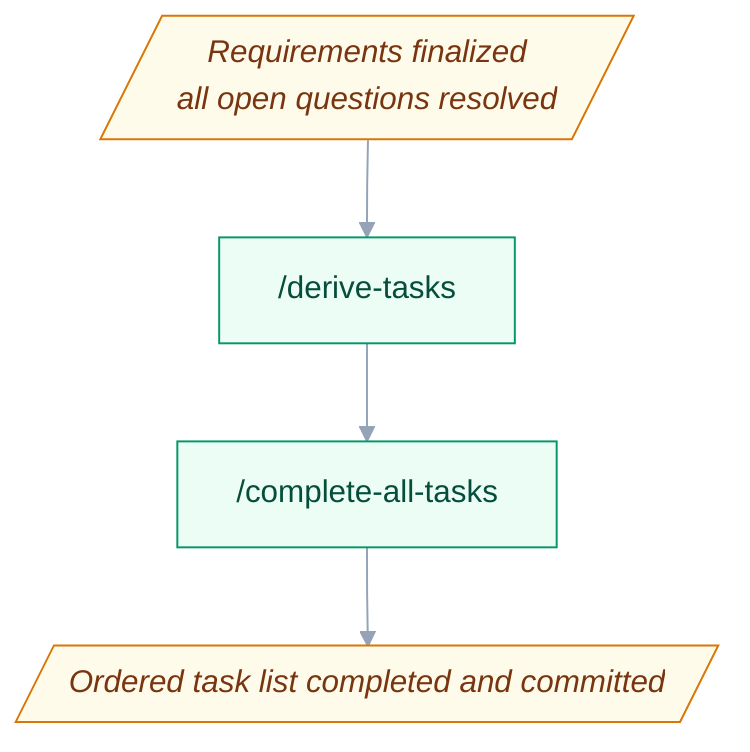
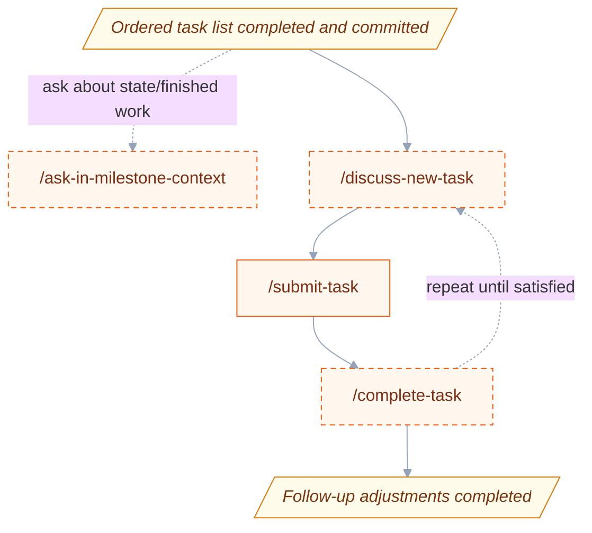
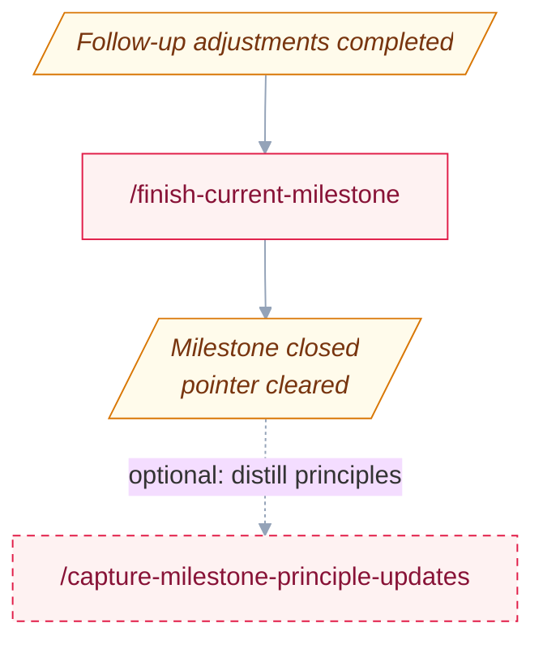

# Workflow

How a milestone moves through Cairn's skills: the six phases of the pipeline, how the skills commit what they change, and how the project learns from every answered question. What each individual skill does is in the [skill reference](skill-reference.md), and how to chain the skills as headless command lines is in [ways of using Cairn](ways-of-using-cairn.md).

## Workflow pipeline

The workflow runs as a stack of six phases. Each phase is its own diagram below, and the amber parallelogram **state** nodes (`D0`–`D5`) are the seams: every phase ends on the state node that the next phase begins with, so the shared node repeats at each boundary and the whole sequence reads top-to-bottom. Node labels are bare skill names — see the [Skill reference](skill-reference.md) for what each one does. Dashed nodes and edges are optional or repeated steps.

### One-time setup

Run once per project, before any milestone work. `/init` records the project's domain context, working conventions, available tools, and how work is verified as done in `CLAUDE.md`; `/init-milestone-base-workflow` first checks the workflow's one runtime prerequisite — a Python 3.9 or later interpreter answering as `python3`, which the skills drive the plugin's open-question tool with — stopping with the remedy when none does, then creates the `milestones/` scaffold and seeds the current-milestone pointer — leaving the workflow scaffold ready.

### Initializing a milestone

From a ready scaffold — or looping back from a just-closed milestone (the dashed **next milestone** entry from `D5`) — shape and open the next milestone. `/discuss-milestone-goal` optionally sharpens a vague idea, `/define-milestone-goal` creates the milestone directory, seeds `requirements.md`, and has the open-question tool write an empty `open_questions.xml` beside it, and `/goto-next-milestone` advances the pointer — leaving the milestone goal defined.

### Iterating milestone requirements

Drive the milestone's requirements to convergence. The prose — goal, starting state, decisions, out of scope — lives in `requirements.md`; the open questions live beside it in `open_questions.xml`, one `<open-question>` XML block per question under a single `<open-questions>` root. That document has exactly one writer: the plugin's stdlib-only Python tool, `tools/open_questions.py`, which every skill runs as `python3` with the milestone directory as its argument. Every deterministic operation over the question set is a tool call — `list`, `locate`, and `lift` to read, `add`, `embed`, `strip`, and `remove` to write, `walk` to order — so the runtime prose keeps only judgment (what a question asks, which questions matter most, what an answer settles), while escaping, indentation, fragment validation, and `<depends-on>` reconciliation are the tool's internals, and every write re-renders the document in one canonical form; a skill reads the file whole only to reason over it, never to find or change a block. `/specify-milestone-starting-state` fills the starting state from the project's existing state, then `/review-milestone-requirements` runs each pass to reconcile, surface new gaps — authoring every finding it surfaces as an ordinary `<open-question>` block through the tool's `add` — and check convergence (repeat until satisfied). Questions are explored with `/discuss-open-question` and recorded with `/answer-open-question`, which commits each answer with its rationale in the commit body (the reusable principle behind it is distilled later by `/capture-milestone-principle-updates`, naturally once the milestone is finished). When a discussion concludes the milestone goal itself must shift, `/discuss-open-question` offers `/modify-milestone-goal` to revise the `## Goal` (then loop back through review to reconcile). The optional `/recommend-all-open-questions` sweep is the batch form of `/discuss-open-question`: it dispatches one recommendation subagent per question **sequentially, most-significant-first**, embedding each returned alternatives-and-recommendation set of XML sub-elements into that question's `<open-question>` block through the tool's `embed` — which validates the fragment before it writes — before the next dispatch, so a later recommendation may build on the sibling recommendations already embedded — and must declare each such use as a `<depends-on question="…" option="…"/>` child of its block, naming the sibling and the option it assumed. The embedded `<recommendation>` element is what `/answer-open-question-with-recommendation` then lifts and records for a single question — or `/answer-all-open-questions-with-recommendation` records for every annotated question at once, walking the dependency graph those tags form from its origins so every target is answered before its dependents. To record a *different* embedded option than the recommended one, `/answer-open-question-with-alternative` lifts an `<alternative>` you name by its id instead. However an answer is recorded, the decision is folded into `## Decisions` of `requirements.md` first and the block is then removed by the tool's `remove`, which reconciles the dependents that assumed the answered question's option in the same write: where the recorded option agrees with a dependent's `<depends-on>` tag only that tag is removed, and where it disagrees — or the comparison is in doubt — the dependent's embedded children are stripped, transitively, leaving the bare question for the next recommend sweep to regenerate (to force a fresh recommendation on a question, the tool's `strip` clears its embedded children the same way). A wrong recorded answer is corrected by reverting its commit (which reopens the question) and re-recording — repeat until no `<open-question>` block remains in `open_questions.xml`.

### Automated one-shot task derivation and completion

Hands-off execution. `/derive-tasks` converts the finalized `requirements.md` into an ordered `TASKS_TODO.md` — decomposing the milestone into briefs and writing them into the task list itself, in one pass, with no second authoring step — and `/complete-all-tasks` works through the list, committing after each task — leaving the ordered task list completed.

### Semi-manual follow-up and adjustments

Inline, conversational adjustments after the automated pass. `/ask-in-milestone-context` answers read-only questions about the milestone at any time; `/discuss-new-task` clarifies a mid-flight issue into briefs that hand off to `/submit-task`; and `/complete-task` completes a single task inline (repeat until satisfied) with the conversation kept for follow-up tweaks — leaving the follow-up adjustments completed.

### Ending a milestone

Close out. `/finish-current-milestone` records accomplishments and clears the pointer, leaving the milestone closed. `/capture-milestone-principle-updates <milestone_id>` is the **on-demand** principle harvester: given a milestone id, it distills reusable answering principles from that milestone's answer commits into the principle store. It lives in this stage because finish is the natural moment to run it — the milestone's answer set is complete by then — but finish is never a precondition: it runs against any milestone whose `requirements.md` exists, the current one and already-finished ones (backfill) included. From `D5` the loop returns to **Initializing a milestone** for the next one.

## How skills commit

Committing is a property of the skill layer, so the workflow leaves a clean, self-describing git history without you staging anything by hand. **Every user-invoked skill that changes files ends by committing exactly those changes** — staged path-scoped (only the paths it touched, never `git add -A`) under its own distinct `<Marker>: <descriptor>` subject derived from what the skill does (`Manual-answer:`, `Task-completion:`, `Task-submission:`, `Requirements-review:`, `Goal-revision:`, `Milestone-finish:`, and so on). **Dispatched subagents never commit** — they stage their own change set path-scoped and return — and **an orchestrator commits the index its agent staged**, at its own granularity: `/complete-all-tasks` commits once per task, `/answer-all-open-questions-with-recommendation` once per answer, and `/recommend-all-open-questions` and `/derive-tasks` once at the end of the run. A pass that changes no file (for example a `/review-milestone-requirements` or `/capture-milestone-principle-updates` pass that finds nothing) commits nothing rather than creating an empty commit.

One setup skill is exempt and leaves its changes **staged** for you instead — `/init-milestone-base-workflow` — because the project it runs in may not be a git repo or may want its own commit boundaries. The purely conversational skills (`/discuss-milestone-goal`, `/discuss-open-question`, `/discuss-new-task`, `/ask-in-milestone-context`) change no files and so never commit. The commit mechanics themselves — the no-op guard, the path-scoped staging, and the commit — live in one shared procedure, `core/shared/commit-procedure.md`, that every committing skill references; the two orchestrators that dispatch agents stage nothing themselves (their agent already did) and simply guard and commit the staged index. One subject family is load-bearing: the three answer subjects are **provenance discriminators**. `/capture-milestone-principle-updates <milestone_id>` walks all three on the named milestone's `open_questions.xml` (every answer removes its block from that file) and reads the subject to tell them apart — `Manual-answer:` and `Alternative-answer:` mark the **override signal** it distills new principles from (prompting you for the override reason where the body records none), while `Recommendation-answer:` marks an accepted recommendation, read only as evidence about principles already in the store and never mined for new ones — so a recommendation-derived answer is never mistaken for hand-authored rationale.

## The answer-principle-learning loop

Open questions get resolved through deliberation, and the project *learns* from every answer that overrides a recommendation. Confirmed answering principles accumulate in `milestones/answer_decision_principles.md` — a single project-wide store at the `milestones/` **root**, above any one milestone, so principles carry across milestones. Each principle is a reusable keep/eliminate directive that, once confirmed, feeds the principle-aware recommendation core `core/shared/recommend-procedure.md` as a **weighted advisory factor**.

- **Teaching flow** — `/discuss-open-question → /answer-open-question` (or `/answer-open-question-with-alternative` to pick a different embedded option). You deliberate a question and record the answer; the answer skill commits the decision — with its rationale in the commit body when one was deliberated — under a subject that marks its provenance. The reusable rule behind it isn't generalized on the spot — it is distilled later by `/capture-milestone-principle-updates <milestone_id>`, an on-demand skill you run for a named milestone (naturally right after finishing it, though that is never a precondition). It walks the milestone's answer commits across all three provenances and reconstructs from each commit's diff the recommendation and cited principles you saw against the answer you recorded: manual and alternative answers that overrode the recommendation are the **override signal**, and where such a commit carries no rationale of yours it asks why you preferred your option (offering its own best guess, with a one-shot accept-all / skip-all choice so backfill over a milestone you no longer remember stays workable); accepted recommendations are evidence only — a cited principle is reinforced, a contradicted one flagged. From the override reasoning it distills the compact guideline the recommender lacked and composes a **whole-store rewrite** — adding, revising, pruning, merging, or generalizing entries, salvaging what it can from a contradicted rule, and keeping each entry as short as it can be while still reading as an intuitive rule — written in place for you to review with `git diff`; one confirmation gates the commit, and a rejection restores the store untouched.
- **Recommendation advisory** — once confirmed, a principle that bears on a question becomes a **weighted advisory factor** in the shared recommendation core `core/shared/recommend-procedure.md` — read in place by both `/discuss-open-question` and `/recommend-all-open-questions`'s `recommend-open-question` agent. It is a strong default in favor of the option it supports (merit may override it only for a specifically stated reason), and it is **cited** whenever it steered the recommended pick — the agent renders each bearing principle as its own `<applied-principle>` element, a sibling of the block's `<recommendation option="...">` element (never baked into the recommendation text, so the lifted answer stays provenance-free). Principles advise recommendations; they never auto-answer.
- **Correction loop** — there is no dedicated correction skill. To correct a wrong recorded answer, revert its commit (which reopens the question) and re-record via `/answer-open-question` (or `/answer-open-question-with-alternative`). Because a confirmed principle is only a weighted advisory factor cited in recommendations — never a binding auto-answer — a principle that steered a recommendation wrong is reconciled the next time `/capture-milestone-principle-updates` is run for that milestone (naturally at its finish): the corrective re-answer is an override commit whose diff still names the principle that was cited, so capture reads the override rationale against it and narrows, generalizes, replaces, or — when nothing survives — prunes the bad entry in the store rewrite you review. For an urgent "this principle is actively wrong" case, hand-edit the plain-Markdown store directly; capture imposes no clean-store precondition and, after a one-line notice, builds its rewrite over your pending edits.
